# Project Vera 🧬


**Project Vera** is a production-grade, stateful AI Research Agent designed for autonomous web synthesis, budget-aware reasoning, and long-term memory retention.  
It is built using **NVIDIA NIM**, **LangGraph**, **Docker**, and modern MLOps best practices.

---

## 🏗️ Architecture

The system follows a **microservice architecture** that cleanly separates **stateless compute** (Docker containers) from **persistent state** (SQLite volume).

```mermaid
graph TD
    User(["👤 User"]) -->|Chat Input| UI["Streamlit UI"]
    UI -->|Stream Events| Graph{"LangGraph Orchestrator"}
    
    subgraph Docker ["Docker Container"]
        Graph -->|Decide| Agent["🧠 Llama 3 8B (NVIDIA NIM)"]
        Graph -->|Search| Tools["🔎 Tavily Search API"]
        Graph -->|Check| Budget["💳 Budget Guardrail"]
    end
    
    subgraph Storage ["Persistent Storage"]
        Graph <-->|Read / Write| DB[("SQLite Memory")]
    end
    
    Agent -->|Response| UI
```



---

## 🚀 Key Features

### 🧠 Logic & Reasoning
- Powered by **Meta Llama 3 (8B)** via optimized **NVIDIA NIM** endpoints.
- LangGraph-driven control flow ensures **deterministic**, **auditable**, and **debuggable** agent behavior.

### 💾 Long-Term Memory
- **SQLite-based persistence** enables the agent to retain user context across:
  - Sessions
  - Container restarts
  - CI/CD environments

### 🛡️ Production Guardrails
- **Budget Circuit Breaker**  
  Automatically halts execution when daily token limits are exceeded.
- **Anti-Loop Protection**  
  Enforces recursion limits to prevent runaway or zombie agent loops.
- **Safety Filter**  
  Strict system prompts prevent hallucinated or unnecessary web searches.

### 🐳 Fully Containerized
- Runs identically across **Development**, **CI**, and **Production** using Docker and Docker Compose.

### ✅ CI/CD Pipeline
- GitHub Actions automatically validate:
  - Agent logic correctness
  - Token budget accounting
  - Database path integrity

### 📄 Document Analysis (RAG)
- **On-Demand Retrieval**: Users can upload PDF documents (Resumes, Papers, Contracts).
- **Hybrid Reasoning**: The agent autonomously decides whether to answer from **Memory**, **Web Search**, or the **Uploaded File**.
- **Vector Search**: Uses **FAISS** and **HuggingFace Embeddings** for semantic search within documents.

## 🛠️ Installation & Setup

### Prerequisites
* **Docker** & **Docker Compose** installed on your machine.
* API Keys for **NVIDIA NIM** (LLM) and **Tavily Search** (Web Browsing).

### Option A: Run with Docker (Recommended)

1.  **Clone the repository**
    ```bash
    git clone [https://github.com/PTX-Tien/project-vera.git](https://github.com/PTX-Tien/project-vera.git)
    cd project-vera
    ```

2.  **Configure Environment**
    Create a `.env` file in the root directory and add your keys:
    ```ini
    NVIDIA_API_KEY=nvapi-...
    TAVILY_API_KEY=tvly-...
    ```

3.  **Build & Launch**
    ```bash
    docker-compose up --build
    ```
    > Access the app at **[http://localhost:8501](http://localhost:8501)**

### Option B: Local Development

1.  **Install Dependencies**
    ```bash
    pip install -r requirements.txt
    ```
2.  **Run the App**
    ```bash
    streamlit run src/app.py
    ```
3.  **Run Tests**
    ```bash
    python tests/test_agent.py
    ```

---

## 📂 Project Structure

```text
project-vera/
├── .github/workflows/    # 🤖 CI/CD Pipelines (GitHub Actions)
├── src/
│   ├── agent.py          # 🧠 LangGraph Logic & Memory
│   ├── app.py            # 🖥️ Streamlit UI & Thread Management
│   └── budget.py         # 💳 Token Counting & Budget Logic
├── tests/                # 🧪 Integration Tests
├── docker-compose.yml    # 🐳 Infrastructure as Code
├── Dockerfile            # 📦 Container Definition
└── requirements.txt      # 🐍 Python Dependencies