# 🧬 Project Vera: AI Research Agent


**Project Vera** is a production-grade, Full-Stack AI Research Agent capable of document analysis, web synthesis, and context-aware reasoning.

It features a **Hybrid Architecture** that combines Neural AI (Llama 3) with Symbolic Logic (LangGraph) to dynamically switch between **RAG (Document Search)**, **Web Research**, and **Instant Chitchat** modes for optimal performance and cost efficiency.

---

## 🏗️ Architecture

The system follows a **Client-Server architecture** separating the React-based frontend from the Async Python backend.

```mermaid
graph TD
    User(["👤 User"]) -->|Chat & Uploads| UI["💻 Next.js Frontend (Port 3000)"]
    UI -->|JSON / Streams| API["🚀 FastAPI Backend (Port 8000)"]
    
    subgraph "Backend Core"
        API -->|Route| Graph{"LangGraph Orchestrator"}
        
        Graph -->|General Chat| Chitchat["⚡ Instant Reply (No Cost)"]
        Graph -->|Document Query| RAG["📄 FAISS + PDF Search"]
        Graph -->|Complex Query| Agent["🧠 Llama 3 8B (NVIDIA NIM)"]
        
        Agent -->|Web Search| Tools["🔎 Tavily Search API"]
    end
    
    subgraph "State Management"
        Graph <-->|Read / Write| Memory[("📝 Session Memory")]
    end
```



---

## 🚀 Key Features

### 🧠 Logic & Reasoning
- Powered by **Meta Llama 3 (8B)** via optimized **NVIDIA NIM** endpoints.

- **Intelligent Routing**: Dynamically switches between retrieval, search, and conversation modes.

- LangGraph-driven control flow ensures **deterministic** and **debuggable** agent behavior.

### 💾 Stateful Memory
- **Session Persistence**: Retains user context and personal details (e.g., names, facts) throughout the active session using robust in-memory checkpointing.

- **Thread Management**: Unique thread IDs ensure conversation isolation for multiple users.

### 🛡️ Production Guardrails
- **Budget Circuit Breaker**: Automatically halts execution when daily token limits are exceeded.

- **Hallucination Filters**: Regex-based safety logic prevents the agent from performing unnecessary web searches for personal statements.

### 🐳 Fully Containerized
- Backend is fully Dockerized for consistent deployment across **Development**, **CI**, and **Production** environments.

### ✅ CI/CD Pipeline
- GitHub Actions automatically validate:
  - Agent logic correctness
  - Token budget accounting
  - Database path integrity

### 📄 Document Analysis (RAG)
- **Drag-and-Drop**: Upload PDF resumes, research papers, or contracts directly via the UI.

- **Local Embeddings**: Uses HuggingFaceEmbeddings and FAISS for fast, secure, CPU-optimized vector search.

- **Context Awareness**: The agent automatically detects if a file is uploaded and adjusts its system prompts accordingly.

## 🛠️ Tech Stack
- **Brain**: Llama 3 (via NVIDIA NIM)

- **Orchestration**: LangChain + LangGraph

- **Backend**: FastAPI (Async Python)

- **Frontend**: Next.js 14, Tailwind CSS, Lucide React

- **Vector DB**: FAISS (Local)

## 💻 Installation & Setup

### Prerequisites
* **Python 3.10+** and **Node.js 18+** installed.
* **Docker** & **Docker Compose** installed.
* API Keys for **NVIDIA NIM** (LLM) and **Tavily Search** (Web Browsing).

### Option A: Hybrid Run (Docker Backend + Local Frontend)

1.  **Start the Backend (Docker)**
    ```bash
    # Clone repository
    git clone https://github.com/PTX-Tien/project-vera.git
    cd project-vera

    # Create .env file
    echo "NVIDIA_API_KEY=nvapi-..." > .env
    echo "TAVILY_API_KEY=tvly-..." >> .env

    # Build and Run Container
    docker-compose up --build
    ```
    > Backend will be live at **[http://localhost:8000/](http://localhost:8000/)**

2.  **Start the Frontend (Local) Open a new terminal:**
    Create a `.env` file in the root directory and add your keys:
    ```bash
    cd vera-frontend
    npm install
    npm run dev
    ```
    > Access the app at **[http://localhost:3000/](http://localhost:3000/)**

### Option B: Full Local Development

1.  **Backend**
    ```bash
    cd project-vera
    pip install -r requirements.txt
    PYTHONPATH=src uvicorn api:app --reload --host 0.0.0.0 --port 8000
    ```
2.  **Frontend**
    ```bash
    cd vera-frontend
    npm run dev
    ```

---

## 📂 Project Structure

```text
project-vera/
├── .github/workflows/    # 🤖 CI/CD Pipelines
├── src/
│   ├── agent.py          # 🧠 LangGraph Logic & Memory
│   ├── api.py            # 🚀 FastAPI Endpoints & Lifespan Manager
│   ├── rag_engine.py     # 📄 FAISS Vector Store & PDF Processing
│   └── budget.py         # 💳 Token Counting & Budget Logic
├── vera-frontend/        # 💻 Next.js Client Code
│   ├── src/app/page.tsx  # ⚛️ Chat UI & State Logic
│   └── tailwind.config.ts
├── docker-compose.yml    # 🐳 Infrastructure as Code
├── Dockerfile            # 📦 Container Definition
└── requirements.txt      # 🐍 Python Dependencies